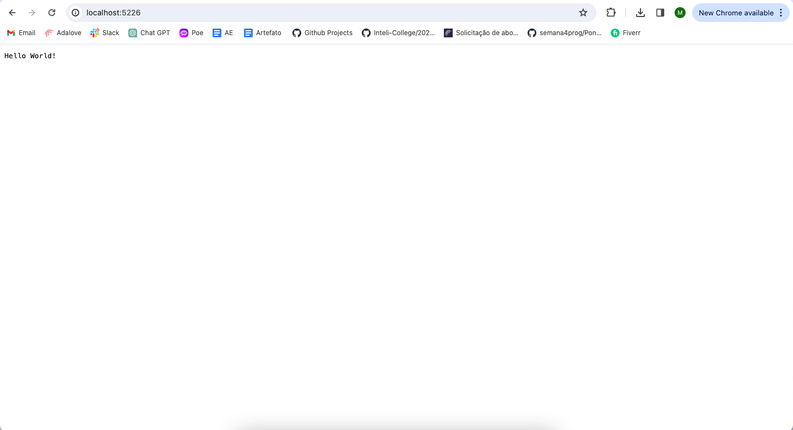

# ponderada_progSem7-2-

## Prometheus e Telemetry

Prometheus é uma ferramenta de código aberto desenvolvida para monitorar e coletar métricas de sistemas e serviços em rede. Ela oferece recursos avançados para consultas flexíveis e a criação de alertas com base em critérios personalizados. Por outro lado, Telemetry se concentra em padronizar a forma como os aplicativos registram telemetria, o que inclui o rastreamento de solicitações, a coleta de métricas e o registro de logs. Essas duas abordagens têm como objetivo facilitar a monitoração e a análise de dados para melhorar o desempenho e a confiabilidade dos sistemas e serviços.

## O que aprendi?

Durante o desenvolvimento da minha pesquisa, tive a oportunidade de explorar profundamente o campo do monitoramento de software e a criação de métricas personalizadas que sejam relevantes para cada cenário específico. Foi uma experiência enriquecedora, e percebi o quão fundamental é adquirir conhecimento sobre o Prometheus para o progresso contínuo do projeto. Compreender e dominar essa ferramenta será essencial para garantir o sucesso e a eficiência das análises no monitoramento dos softwares em questão.

**Arquivo .csproj**

```
<ItemGroup>
    <PackageReference Include="OpenTelemetry.Exporter.Console" Version="1.5.0" />
    <PackageReference Include="OpenTelemetry.Exporter.OpenTelemetryProtocol" Version="1.5.0" />
    <PackageReference Include="OpenTelemetry.Exporter.Prometheus.AspNetCore" Version="1.5.0-rc.1" />
    <PackageReference Include="OpenTelemetry.Extensions.Hosting" Version="1.5.0" />
    <PackageReference Include="OpenTelemetry.Instrumentation.AspNetCore" Version="1.5.0-beta.1" />
    <PackageReference Include="OpenTelemetry.Instrumentation.Http" Version="1.5.0-beta.1" />
</ItemGroup>
  ```

  **Arquivo .cs**

  ```
    using System.Diagnostics;
    using System.Diagnostics.Metrics;
    using OpenTelemetry.Metrics;
    using OpenTelemetry.Resources;
    using OpenTelemetry.Trace;
  ```

 ### Métrica

 ```
    var greeterMeter = new Meter("OtPrGrYa.Example", "1.0.0");
    var countGreetings = greeterMeter CreateCounter<int>("greetings.count", description: "Counts the number of greetings");
 ```

### Resultado

